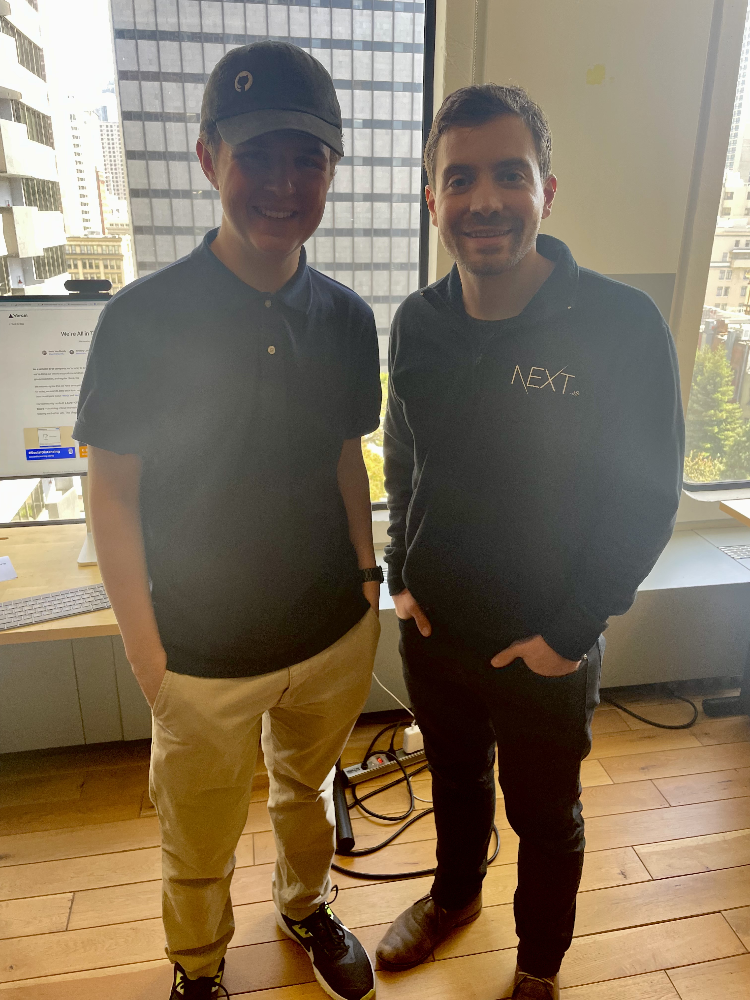

import { Row, Column } from './components/Align'
import Title from './components/Title'
import Copyright from './components/Copyright'
import './main.css'
import './entrepreneur.css'

<Head>
  <title>Guillermo</title>
  <link rel="icon" href="https://mattglei.ch/icons/favicon.ico" />
</Head>

<main>
  <Row>
    <Column position="left" animation=" ">
      <Title animation="animate__fadeInUp animate__delay-1s">
        Guillermo Rauch
      </Title>
      <h2
        className="animate__animated animate__fadeInUp animate__delay-2s"
        style={{ margin: 0 }}
      >
        CEO of Vercel
      </h2>
      <h3 className="animate__animated animate__fadeInUp animate__delay-3s">
        By Matt Gleich
      </h3>
    </Column>
    <Column position="right" animation="animate__fadeIn animate__delay-1s">
      
    </Column>
  </Row>
  <Copyright delay="3" />
</main>

---

# Back Story

---

<Notes>
  - Born in Buenos Aires, Argentina in 1990
   - Learned how to develop websites with very little access to the internet.
   - Started to contribute to open-source. Open-source is a type of code
  that anyone can suggest changes to. This means that you can work on some of
  the biggest projects in the world with some of the best developers in the
  world with just an internet connection.
   - He ended up dropping out of high school as he started to get clients and
  made huge strides in his software career.
</Notes>

- Buenos Aires, Argentina
- Born in 1990
- Learned to code and build websites
- Lacked access to the internet
- Started contributing to open-source
- Dropped out of high school

---

# Current Work

---

<Notes>
  - In 2015 he founded a company called Vercel.
   - Vercel has been on the hottest startups in tech with over $102M in Series
  C funding was raised this year.
   - Although it isn't Vercel's main product they also have created one of
  the most popular web frameworks in the world through a product called Next.js.
  A web framework is simply a set of code resources that make it easier to build
  websites.
</Notes>

- Founded a company called Vercel in 2015
- Raised $102M in Series C back in June of 2021
- Founded one of the most popular web frameworks in the world

---

# What is Vercel?

---

<Notes>
  - Vercel is a hosting company. They will take your website and host it with
  ease.
   - They have an amazing developer experience.
   - They make it easy for developer iteration as you can preview changes
  and deploy changes with ease.
   - Create extremely high-quality software
</Notes>

<svg
  width="573"
  height="190"
  viewBox="0 0 573 190"
  fill="none"
  xmlns="http://www.w3.org/2000/svg"
  className="animate__animated animate__fadeInDown"
>
  <rect
    x="30"
    y="55"
    width="191"
    height="81"
    rx="5"
    stroke="white"
    strokeWidth="2"
  />
  <path
    d="M97.7041 96.877V103H95.6416V87.3594H101.41C103.122 87.3594 104.461 87.7962 105.428 88.6699C106.402 89.5436 106.889 90.7002 106.889 92.1396C106.889 93.6579 106.412 94.8288 105.46 95.6523C104.515 96.4688 103.158 96.877 101.389 96.877H97.7041ZM97.7041 95.1904H101.41C102.513 95.1904 103.358 94.9326 103.945 94.417C104.533 93.8942 104.826 93.1423 104.826 92.1611C104.826 91.2301 104.533 90.4854 103.945 89.9268C103.358 89.3682 102.552 89.0781 101.528 89.0566H97.7041V95.1904ZM111.196 92.7842C112.077 91.7028 113.223 91.1621 114.634 91.1621C117.09 91.1621 118.329 92.5479 118.351 95.3193V103H116.363V95.3086C116.356 94.4707 116.163 93.8512 115.783 93.4502C115.411 93.0492 114.827 92.8486 114.032 92.8486C113.388 92.8486 112.822 93.0205 112.335 93.3643C111.848 93.708 111.468 94.1592 111.196 94.7178V103H109.209V86.5H111.196V92.7842ZM120.8 97.0811C120.8 95.9424 121.022 94.9183 121.466 94.0088C121.917 93.0993 122.54 92.3975 123.335 91.9033C124.137 91.4092 125.05 91.1621 126.074 91.1621C127.657 91.1621 128.935 91.71 129.909 92.8057C130.89 93.9014 131.381 95.3587 131.381 97.1777V97.3174C131.381 98.4489 131.162 99.4658 130.726 100.368C130.296 101.263 129.676 101.962 128.867 102.463C128.065 102.964 127.141 103.215 126.096 103.215C124.52 103.215 123.242 102.667 122.261 101.571C121.287 100.476 120.8 99.0254 120.8 97.2207V97.0811ZM122.798 97.3174C122.798 98.6064 123.095 99.6413 123.689 100.422C124.291 101.202 125.093 101.593 126.096 101.593C127.105 101.593 127.908 101.199 128.502 100.411C129.096 99.6162 129.394 98.5062 129.394 97.0811C129.394 95.8063 129.089 94.7751 128.48 93.9873C127.879 93.1924 127.077 92.7949 126.074 92.7949C125.093 92.7949 124.302 93.1852 123.7 93.9658C123.099 94.7464 122.798 95.8636 122.798 97.3174ZM135.753 91.377L135.817 92.8379C136.705 91.7207 137.866 91.1621 139.298 91.1621C141.754 91.1621 142.993 92.5479 143.015 95.3193V103H141.027V95.3086C141.02 94.4707 140.827 93.8512 140.447 93.4502C140.075 93.0492 139.491 92.8486 138.696 92.8486C138.052 92.8486 137.486 93.0205 136.999 93.3643C136.512 93.708 136.132 94.1592 135.86 94.7178V103H133.873V91.377H135.753ZM150.835 103.215C149.259 103.215 147.978 102.699 146.989 101.668C146.001 100.63 145.507 99.2438 145.507 97.5107V97.1455C145.507 95.9925 145.725 94.9648 146.162 94.0625C146.606 93.153 147.222 92.444 148.01 91.9355C148.805 91.4199 149.664 91.1621 150.588 91.1621C152.099 91.1621 153.273 91.6598 154.111 92.6553C154.949 93.6507 155.368 95.0758 155.368 96.9307V97.7578H147.494C147.523 98.9036 147.856 99.8311 148.493 100.54C149.138 101.242 149.954 101.593 150.942 101.593C151.644 101.593 152.239 101.45 152.726 101.163C153.213 100.877 153.639 100.497 154.004 100.024L155.218 100.97C154.244 102.466 152.783 103.215 150.835 103.215ZM150.588 92.7949C149.786 92.7949 149.113 93.0885 148.568 93.6758C148.024 94.2559 147.688 95.0723 147.559 96.125H153.381V95.9746C153.324 94.9648 153.051 94.1842 152.564 93.6328C152.077 93.0742 151.419 92.7949 150.588 92.7949Z"
    fill="white"
  />
  <rect
    x="348"
    y="55"
    width="191"
    height="81"
    rx="5"
    stroke="white"
    strokeWidth="2"
  />
  <path
    d="M418.422 96.0283C416.653 95.5199 415.364 94.8968 414.555 94.1592C413.753 93.4144 413.352 92.4977 413.352 91.4092C413.352 90.1774 413.842 89.1605 414.823 88.3584C415.812 87.5492 417.093 87.1445 418.669 87.1445C419.743 87.1445 420.699 87.3522 421.537 87.7676C422.382 88.1829 423.034 88.7559 423.492 89.4863C423.958 90.2168 424.19 91.0153 424.19 91.8818H422.117C422.117 90.9365 421.816 90.1953 421.215 89.6582C420.613 89.1139 419.765 88.8418 418.669 88.8418C417.652 88.8418 416.857 89.0674 416.284 89.5186C415.718 89.9626 415.436 90.582 415.436 91.377C415.436 92.0143 415.704 92.555 416.241 92.999C416.785 93.4359 417.706 93.8369 419.002 94.2021C420.305 94.5674 421.322 94.972 422.053 95.416C422.79 95.8529 423.335 96.3649 423.686 96.9521C424.044 97.5394 424.223 98.2305 424.223 99.0254C424.223 100.293 423.729 101.31 422.74 102.076C421.752 102.835 420.431 103.215 418.776 103.215C417.702 103.215 416.7 103.011 415.769 102.603C414.838 102.187 414.118 101.621 413.609 100.905C413.108 100.189 412.857 99.3763 412.857 98.4668H414.931C414.931 99.4121 415.278 100.16 415.973 100.712C416.674 101.256 417.609 101.528 418.776 101.528C419.865 101.528 420.699 101.306 421.279 100.862C421.859 100.418 422.149 99.8132 422.149 99.0469C422.149 98.2806 421.881 97.6898 421.344 97.2744C420.807 96.8519 419.833 96.4365 418.422 96.0283ZM431.388 103.215C429.812 103.215 428.53 102.699 427.542 101.668C426.554 100.63 426.06 99.2438 426.06 97.5107V97.1455C426.06 95.9925 426.278 94.9648 426.715 94.0625C427.159 93.153 427.775 92.444 428.562 91.9355C429.357 91.4199 430.217 91.1621 431.141 91.1621C432.652 91.1621 433.826 91.6598 434.664 92.6553C435.502 93.6507 435.921 95.0758 435.921 96.9307V97.7578H428.047C428.076 98.9036 428.409 99.8311 429.046 100.54C429.69 101.242 430.507 101.593 431.495 101.593C432.197 101.593 432.791 101.45 433.278 101.163C433.765 100.877 434.191 100.497 434.557 100.024L435.771 100.97C434.797 102.466 433.336 103.215 431.388 103.215ZM431.141 92.7949C430.339 92.7949 429.665 93.0885 429.121 93.6758C428.577 94.2559 428.24 95.0723 428.111 96.125H433.934V95.9746C433.876 94.9648 433.604 94.1842 433.117 93.6328C432.63 93.0742 431.971 92.7949 431.141 92.7949ZM443.849 93.1602C443.548 93.11 443.222 93.085 442.871 93.085C441.568 93.085 440.683 93.64 440.218 94.75V103H438.23V91.377H440.164L440.196 92.7197C440.848 91.6813 441.772 91.1621 442.968 91.1621C443.354 91.1621 443.648 91.2122 443.849 91.3125V93.1602ZM449.714 100.304L452.593 91.377H454.623L450.455 103H448.94L444.729 91.377H446.76L449.714 100.304ZM461.208 103.215C459.632 103.215 458.351 102.699 457.362 101.668C456.374 100.63 455.88 99.2438 455.88 97.5107V97.1455C455.88 95.9925 456.098 94.9648 456.535 94.0625C456.979 93.153 457.595 92.444 458.383 91.9355C459.178 91.4199 460.037 91.1621 460.961 91.1621C462.472 91.1621 463.646 91.6598 464.484 92.6553C465.322 93.6507 465.741 95.0758 465.741 96.9307V97.7578H457.867C457.896 98.9036 458.229 99.8311 458.866 100.54C459.511 101.242 460.327 101.593 461.315 101.593C462.017 101.593 462.612 101.45 463.099 101.163C463.586 100.877 464.012 100.497 464.377 100.024L465.591 100.97C464.617 102.466 463.156 103.215 461.208 103.215ZM460.961 92.7949C460.159 92.7949 459.486 93.0885 458.941 93.6758C458.397 94.2559 458.061 95.0723 457.932 96.125H463.754V95.9746C463.697 94.9648 463.424 94.1842 462.938 93.6328C462.451 93.0742 461.792 92.7949 460.961 92.7949ZM473.669 93.1602C473.368 93.11 473.042 93.085 472.691 93.085C471.388 93.085 470.504 93.64 470.038 94.75V103H468.051V91.377H469.984L470.017 92.7197C470.668 91.6813 471.592 91.1621 472.788 91.1621C473.175 91.1621 473.468 91.2122 473.669 91.3125V93.1602Z"
    fill="white"
  />
  <path
    d="M235 93.5L220 86.3397V103.66L235 96.5V93.5ZM332 96.5L347 103.66V86.3397L332 93.5V96.5ZM233.5 96.5H333.5V93.5H233.5V96.5Z"
    fill="white"
  />
</svg>

- Web hosting
- Strong DX (Developer Experience)
- Fast iteration

---

# Accomplishments

---

- Contributor to MooTools
- Founder of LearnBoost
- Founder of CloudUp
- Creator of socket.io
- Founder & CEO of Vercel

---

# Investing

---

- Invested in over 19 companies
- Most recent investment is 09/20/21

---

# Donations

---

Donations to organizations such as [hackclub](https://hackclub.com) to help kids get access to coding resources he wish he had as a kid.

---

# Takeaways

---

- Quality is always important
- DX is huge
- Solve problems you have in your day-to-day life as a developer
- Surround yourself with great people

---

---

# Sources

---

- [Hack Club AMA w/ Guillermo Rauch: Full Interview](https://www.youtube.com/watch?v=PXlDzMMZydk)
- [CB Insights - Angel Investor Portfolio](https://www.cbinsights.com/investor/guillermo-rauch)
- [Vercel](https://vercel.com)
